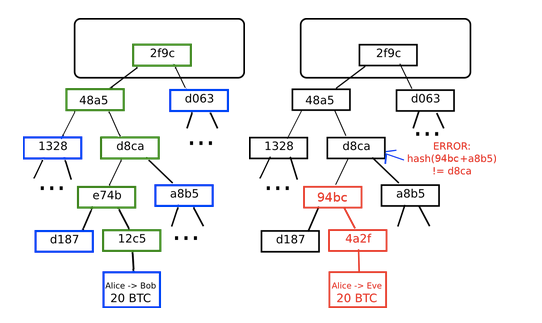

参考：
- [ethereum whitepaper](https://github.com/ethereum/wiki/blob/master/pages/white-paper/%5Benglish%5D-white-paper.md)

该篇是对英文版白皮书学习的笔记，并非完整翻译。

## 下一代智能合约和去中心应用平台
比特币从2009年开始有了长足的发展，但更重要的是底层区块链技术作为分布式共识工具的实验。以太坊期望提供一个內建图灵完备语言的区块链，该语言可以实现任意的系统。

## 介绍比特币和已存在的概念
### 历史
去中心化的电子货币概念几十年前就已出现。八九十年代，匿名的e-cash协议依赖于中心化的机构，没能兴起。1998年，b-money介绍了一个想法，通过解决计算问题和去中心化的共识来创建钱，但该提议缺少去中心化共识实现的细节。2005年，Hal Finney提出“可重复使用的工作量证明”，该系统结合了b-money和Adam Back的困难的hashcash难题来创建加密货币的概念，但是再次依赖可信任的计算后端。2009年，中本聪在实践中第一次实现去中心化的货币，它结合了已存在的技术，使用公钥加密来管理所有权，使用共识算法来追溯谁拥有货币，该算法称为“工作量证明”。

工作量证明机制是一个突破，它同时解决了两个问题。首先，它提供了一个简单和适当有效的共识算法，允许网络中的节点收集针对比特币账户状态确定更新的投票。第二，它提供了机制允许空闲节点加入共识过程，解决了谁影响共识的问题，同时解决了黑客攻击。通过设置一个正常的障碍，例如要求注册一个独立、有经济要求的主体，在共识投票过程中，单个节点的权重和它的计算能力成正比。因此，一种替代的方法“权益证明”提出，节点的权重和它拥有的货币成正比，而非计算能力。本文不讨论这两种实现方法的优点，但这两种方法都可以作为加密货币的基石。

### 比特币是一个状态转变系统
比特币不像现在银行的账户，每个账户有余额，比特币的状态是所有币的集合，称之UTXO（unspent transaction outputs）。每个UTXO有面额和所有者，每个人的余额由所有UTXO计算得出。

### 挖矿
中心化的系统很容易实现，但比特币尝试建立去中心化的货币系统，因此需要结合状态交易系统和共识系统。共识系统要求网络中的节点不断尝试打包。大约每10分钟产生一个块，每个块包含了时间戳、随机数、上一个块的引用和上一个块到现在所有的交易列表。随着时间推移，产生了稳定的、随着时间推移的区块链。

判断块是否有效的算法如下：
- 判断上一个块是否存在、有效。
- 判断时间戳是否小于上一个块，过去的时间是否小于2小时
- 工作量证明是否有效
- S[0]是否是上一个块的最后状态
- 假定TX是交易列表，执行S[i+1] = APPLY(S[i],TX[i])，如果任一个执行失败，退出，返回false
- 返回true，注册S[n]为块的最后状态

本质上，块中的每个交易必须提供从交易执行前的规范状态到新状态的有效状态转变。注意，状态并非编码在块中，它仅仅是被有效节点记录的抽象，只能够被任何块从初始状态和逐个计算所有块的交易计算出。另外，注意块中交易的顺序，不能颠倒。

有一个合法条件在其它系统中找不到的是“工作量证明”。这个精确的条件是块的两次SHA256，有256位数字，必须小于动态调整的数，在写这个时大约为2^187。目的是使块的产生困难，避免黑客重塑整个区块链。因为SHA-256被设计成完全不可预测的伪随机函数，产生有效块的唯一方法就是简单尝试、报错，重复增加随机值，看新的随机值是否匹配。

在当前目标数是2^187时，网络平均尝试2^69次。一般地，目标数在产生2016个块时自动校准，以使块每十分钟产生一个。为了补偿挖矿，每个块矿工可以得到25比特币。另外，如果交易的输入面额大于输出面额，差额部分作为交易费给矿工。这也是比特币发行的机制，初始状态是没有币的。

为了更好的理解挖矿，我们来检查下恶意攻击会发生什么。由于比特币底层的加密是安全的，攻击者会攻击比特币中没有加密直接保护的部分：交易顺序，攻击者策略很简单：
- 给商家发100 BTC，购买商品（最好是交易快速的数字商品）
- 等待商品到来
- 发起另一笔交易给自己发同样的100 BTC
- 使网络相信发给自己的交易是最早的

一旦第一步发生，几分钟后一些矿工将交易打包进块，块号为270000。一个小时后，5个块将加到那个块后面，每个块都间接地指向并确认这笔交易。这这个点上，商家将收到付款，发出商品；因为我们假定这是数字商品，发货瞬间完成。现在，攻击者产生一个转100BTC给自己的交易。如果攻击者仅仅简单发出去，交易不会执行；矿工尝试执行APPLY(S, TX)，并注意到TX花费一个不存在的UTXO。所有攻击者产生一个区块链的分支，打包一个新的270000块，该块的父块还是指向26999，只是新的交易替换了旧的。因为块数据不同，需要重新做工作量证明。再者，攻击者新版本的270000块有不同的hash，因此270001-270005不指向它。那么，原来的链和攻击者的新链使完全分开的。最长的链会被认为是合法的，合法的矿工将继续工作在270005链上，而攻击者独自工作在270000链上。为了使攻击者的链最长，他需要更多的计算能力去追赶，叫着51%攻击。

### 默克尔树

比特币一个重要的扩展特性是块存储在多层数据结构中。块的哈希是块的头部hash，头部大约200字节的数据区域，包含时间戳、随机数、前一个块的哈希和包含所有交易的默克尔树的跟哈希。默克尔树是二叉树的一种，由一些节点构成，大量包含数据的叶子节点在树的底部，中间节点是它两个孩子节点的哈希，最终只有一个根节点。默克尔树的允许块中的数据可以分片传输：一个节点可以从一个资源处下载块头，和他们相关树的一小部分从其它的资源处下载，同时确保所有的数据是正确的。有效的原因是哈希向上传播：如果一个恶意用户试图将伪造的交易换到默克尔树的底部，这会改变它上面的节点，再上面的节点也会改变，最终改变树的根节点和块的哈希，导致协议将它注册为一个完全不同的块（几乎可以肯定的是有无效的工作证明）。
