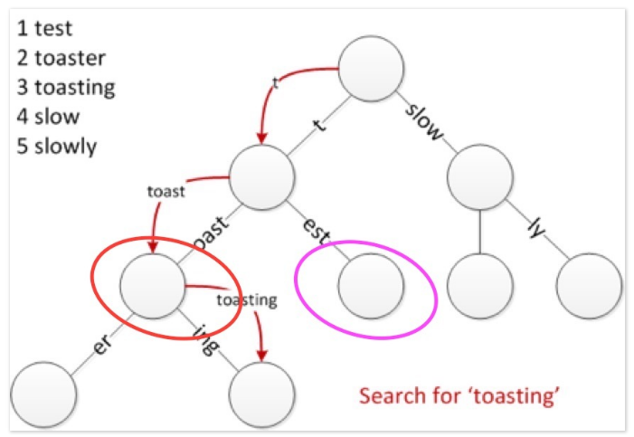
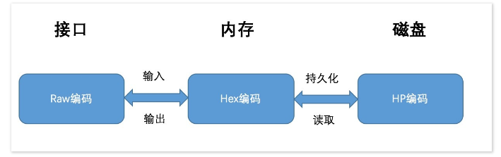

参考：
- [Merkle Patricia Tree详解](http://ethfans.org/posts/588)

## 概述
Merkle Patricia Tree（又称为Merkle Patricia Trie）是一种经过改良的、融合了默克尔树和前缀树两种树结构优点的数据结构，是以太坊中用来组织管理账户数据、生成交易集合哈希的重要数据结构。

## 前缀树
- 优点
  - 相对hash表，查找前缀为pre的单词，不需要遍历整个表，仅遍历以这个节点为根节点的子树即可。
  - 没有hash冲突的问题。
- 缺点
 - 查找效率低下，效率为O(m)，m为key的长度。
 - 空间浪费，key的长度很长，且没有与他相同前缀的节点。

## 默克尔树
进行数据正确性的验证

- 优势
 - 快速重hash：当一个节点被修改后，对该分支重hash，快速得到新的根hash代表整颗树的状态。
 - 轻节点扩展：不需要同步完全节点的数据，可以验证交易。
- 缺点
 - 存储空间开销大

## mpt树节点
### 空节点
用来表示空串。
### 分支节点
分支节点用来表示MPT树中所有拥有超过1个孩子节点以上的非叶子节点
### 叶子节点&扩展节点
节点定义相似
#### key
通过编码路径压缩，提高节点的查找效率，避免过多的磁盘访问；
减少存储空间浪费，避免存储无用的节点；  

- key三种编码的转换
 >

#### value
- 对于叶子节点来说，该字段存储的是一个数据项的内容；
- 而对于扩展节点来说，该字段可以是以下两种内容：Val字段存储的是其孩子节点在数据库中存储的索引值（其实该索引值也是孩子节点的哈希值）；
Val字段存储的是其孩子节点的引用；
 >为什么设计在扩展节点的Val字段有可能存储一串哈希值作为孩子节点的索引呢？

 >在以太坊中，该哈希代表着另外一个节点在数据库中索引，即根据这个哈希值作为数据库中的索引，可以从数据库中读取出另外一个节点的内容。

 >这种设计的目的是：
 （1）当整棵树被持久化到数据库中时，保持节点间的关联关系；
 （2）从数据库中读取节点时，尽量避免不必要的IO开销；

 >在内存中，父节点与子节点之间关联关系可以通过引用、指针等编程手段实现，但是当树节点持久化到数据库是，父节点中会存储一个子节点在数据库中的索引值，以此保持关联关系。

 >同样，从数据库中读取节点时，本着最小IO开销的原则，仅需要读取那些需要用到的节点数据即可，因此若目前该节点已经包含所需要查找的信息时，便无须将其子节点再读取出来；反之，则根据子节点的哈希索引递归读取子节点，直至读取到所需要的信息。

- value内容可以不同，如何区分？
 >从Raw编码向Hex编码的转换规则是：
 将Raw编码的每个字符，根据高4位低4位拆成两个字节；
 若该Key对应的节点存储的是真实的数据项内容（即该节点是叶子节点），则在末位添加一个ASCII值为16的字符作为终止标志符；
 若该key对应的节点存储的是另外一个节点的哈希索引（即该节点是扩展节点），则不加任何字符；
