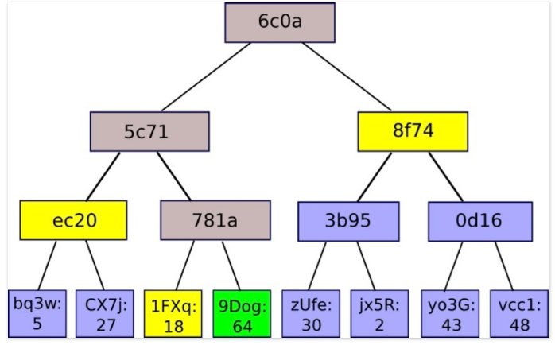

## [交易验证过程](http://8btc.com/article-2002-1.html)
原理：block header中有三个关键字段，一是prev_block_hash(前一区块的hash值，确保了区块链所记录的交易次序）；二是bits（当前区块的计算难度）, 三是merkle_root_hash（借助merkle tree算法，确保收录与区块中所有交易的真实性）。

验证某个交易是否真实存在时，理论上，用户可以通过以下方式进行验证：
- 从网络上获取并保存最长链的所有block header至本地；
- 计算该交易的hash值tx_hash；
- 定位到包含该tx_hash所在的区块，验证block header是否包含在已知的最长链中；
- 从区块中获取构建merkle tree所需的hash值；
- 根据这些hash值计算merkle_root_hash；
- 若计算结果与block header中的merkle_root_hash相等，则交易真实存在。
- 根据该block header所处的位置，确定该交易已经得到多少个确认。

## [默克尔树证明过程](http://ethfans.org/posts/588)
如有棵如下图所示的merkle树，如果某个轻节点想要验证9Dog:64这个树节点是否存在与默克尔树中，只需要向全节点发送该请求，全节点会返回一个1FXq:18, ec20,
8f74的一个路径（默克尔路径，如图2黄色框所表示的）。得到路径之后，轻节点利用9Dog:64与1FXq:18求哈希，在与ec20求哈希，最后与8f74求哈希，得到的结果与本地维护的根哈希相比，是否相等。

- 证明的安全性
 - 若全节点返回的是一条恶意的路径？试图为一个不存在于区块链中的节点伪造一条合法的merkle路径，使得最终的计算结果与区块头中的默克尔根哈希相同。

   由于哈希的计算具有不可预测性，使得一个恶意的“全”节点想要为一条不存在的节点伪造一条“伪路径”使得最终计算的根哈希与轻节点所维护的根哈希相同是不可能的。

 - 为什么不直接向全节点请求该节点是否存在于区块链中？

   由于在公链的环境中，无法判断请求的全节点是否为恶意节点，因此直接向某一个或者多个全节点请求得到的结果是无法得到保证的。但是轻节点本地维护的区块头信息，是经过工作量证明验证的，也就是经过共识一定正确的，若利用全节点提供的默克尔路径，与代验证的节点进行哈希计算，若最终结果与本地维护的区块头中根哈希一致，则能够证明该节点一定存在于默克尔树中。
