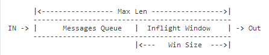

[架构设计](http://docs.emqtt.cn/zh_CN/latest/design.html)

- 100万连接

多核服务器和现代操作系统内核层面，可以很轻松支持100万 TCP 连接，核心问题是应用层面如何处理业务瓶颈。

EMQ 消息服务器在业务和应用层面，解决了承载100万连接的各类瓶颈问题。连接测试的操作系统内核、TCP 协议栈、Erlang 虚拟机参数: http://docs.emqtt.cn/zh_CN/latest/tune.html

- 消息持久化

EMQ 1.0 版本不支持服务器内部消息持久化，这是一个架构设计选择。首先，EMQ 解决的核心问题是连接与路由；其次，我们认为内置持久化是个错误设计。

传统内置消息持久化的 MQ 服务器，比如广泛使用的 JMS 服务器 ActiveMQ，几乎每个大版本都在重新设计持久化部分。内置消息持久化在设计上有两个问题:

如何平衡内存与磁盘使用？消息路由基于内存，消息存储是基于磁盘。
多服务器分布集群架构下，如何放置 Queue 如何复制 Queue 的消息？
Kafka 在上述问题上，做出了正确的设计：一个完全基于磁盘分布式 Commit Log 的消息服务器。

EMQ 2.0 版本将发布 EMQ X 平台产品，支持消息持久化到 Redis、Kafka、Cassandra、PostgreSQL 等数据库。

设计上分离消息路由与消息存储职责后，数据复制容灾备份甚至应用集成，可以在数据层面灵活实现。

- 消息队列与飞行窗口

会话层通过一个内存消息队列和飞行窗口处理下发消息:

飞行窗口(Inflight Window)保存当前正在发送未确认的 Qos1/2 消息。窗口值越大，吞吐越高；窗口值越小，消息顺序越严格。

当客户端离线或者飞行窗口(Inflight Window)满时，消息缓存到队列。如果消息队列满，先丢弃 Qos0 消息或最早进入队列的消息。
