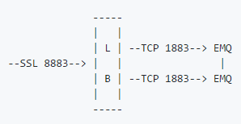

## 集群原理可简述为下述两条规则:
- MQTT客户端订阅主题时，所在节点订阅成功后广播通知其他节点：某个主题(Topic)被本节点订阅。以第一次订阅有效，当该broker宕机后，其订阅会被转移到其他的broker。
- MQTT客户端发布消息时，所在节点会根据消息主题(Topic)，检索订阅并路由消息到相关节点。

## 订阅消息发送规则
- 同一个topic，相同的clientId订阅者只会消费一次。即使相同clientId，多个订阅者，broker集群会随机选择一个发送消息。
- 同一个topic，不同的clientId订阅者都会消费一次。

## 集群负载均衡
- EMQ 集群通常部署在负载均衡器(LB)后面，典型架构:

HAProxy、NGINX等常用的负载均衡器(LB)，一般通过Proxy Protocol协议传递TCP连接源地址、源端口给EMQ。

EMQ 2.2 版本的监听器开启Proxy Protocol支持:
~~~shell
## Proxy Protocol V1/2
listener.tcp.${name}.proxy_protocol = on
listener.tcp.${name}.proxy_protocol_timeout = 3s
~~~
